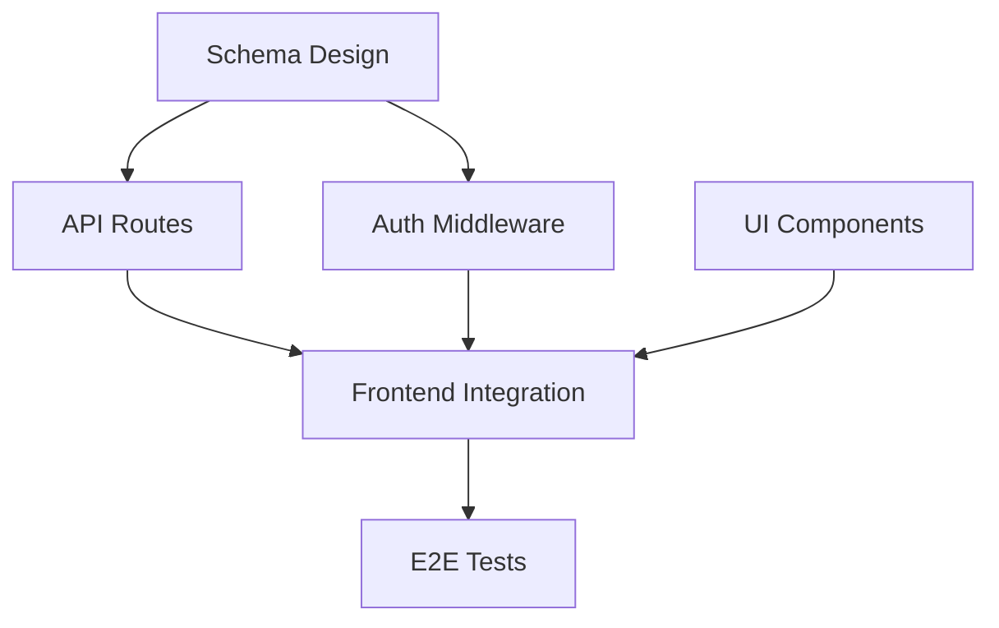

# Dependency Mapping

Techniques for identifying task dependencies, detecting blocking relationships, and optimizing execution order for maximum parallelization.

## Quick Start

**Analyze dependencies:**
```
Map the dependencies between these tasks and identify what can run in parallel
```

**Find critical path:**
```
What is the critical path through this task list? Which tasks block the most work?
```

**Detect issues:**
```
Check these tasks for circular dependencies or unnecessary blocking relationships
```

## Dependency Types

### Direct Dependencies

| Type | Symbol | Description | Example |
|------|--------|-------------|---------|
| Finish-to-Start (FS) | A -> B | B cannot start until A finishes | Migration -> API using new schema |
| Start-to-Start (SS) | A => B | B cannot start until A starts | Frontend development => API development |
| Finish-to-Finish (FF) | A ->> B | B cannot finish until A finishes | Feature code ->> Feature tests |
| Start-to-Finish (SF) | A =>> B | B cannot finish until A starts | Rarely used in software |

**Most common:** Finish-to-Start (FS) - default assumption for task planning.

### Dependency Categories

| Category | Characteristics | Mitigation |
|----------|-----------------|------------|
| **Hard** | Cannot be changed, technical necessity | Accept and plan around |
| **Soft** | Preference-based, could be reordered | Challenge and potentially remove |
| **External** | Waiting on third party | Identify early, create contingency |
| **Resource** | Same person/agent needed | Parallelize where possible |

## Dependency Detection

### Code-Level Dependencies

Identify dependencies based on what code changes require:

```markdown
## File Dependency Analysis

### Schema Changes (Foundation Layer)
- prisma/schema.prisma modifications
- Must complete before: Any code using affected models

### Type Definitions
- types/*.ts, interfaces/*.ts
- Must complete before: Code importing these types

### Shared Utilities
- lib/*.ts, utils/*.ts
- Must complete before: Consumers of these utilities

### API Endpoints
- app/api/**/*.ts
- Must complete before: Frontend calling these APIs

### UI Components
- components/*.tsx
- Can often parallel with API work (mock data)
```

### Dependency Questions

For each task, ask:

1. **Inputs:** What files/data does this task need that don't exist yet?
2. **Outputs:** What does this task produce that others need?
3. **Side Effects:** Does this task change shared state (DB, cache, files)?
4. **Contracts:** Does this task define interfaces others will implement?

### Dependency Matrix

Create a matrix to visualize all relationships:

```
         | T1 | T2 | T3 | T4 | T5 | T6 |
---------|----|----|----|----|----|----|
Task 1   |    |    |    |    |    |    |
Task 2   | X  |    |    |    |    |    |  (T2 depends on T1)
Task 3   |    |    |    |    |    |    |
Task 4   | X  | X  |    |    |    |    |  (T4 depends on T1, T2)
Task 5   |    |    | X  |    |    |    |  (T5 depends on T3)
Task 6   |    |    |    | X  | X  |    |  (T6 depends on T4, T5)
```

## Visualization Formats

### Text-Based DAG (Directed Acyclic Graph)

```
[T1: Schema] ─────────┬─────────────────────────┐
                      │                         │
                      v                         v
             [T2: API Routes] ────────> [T4: Integration]
                      │                         │
                      v                         │
             [T3: Auth Middleware]              │
                      │                         │
                      └─────────────────────────┘
                                                │
                                                v
                                        [T5: E2E Tests]
```

### Gantt-Style Parallel Groups

```
Group 1:  ████████ T1: Schema
          ████████ T3: UI Components

Group 2:       ████████ T2: API Routes (after T1)
               ████████ T4: Auth (after T1)

Group 3:            ████████ T5: Integration (after T2, T4)

Group 4:                 ████████ T6: Tests (after T5)
```

### Mermaid Diagram Syntax



## Parallelization Analysis

### Identifying Parallel Opportunities

Tasks CAN run in parallel when:
- No shared file modifications
- No producer-consumer relationship
- Different architectural layers
- Independent features

Tasks MUST run sequentially when:
- One creates what another reads
- Database migrations involved
- Shared state modifications
- Output validation required

### Parallel Execution Groups

Organize tasks into execution groups:

```markdown
## Parallel Execution Plan

### Group 1: Foundation (Start Immediately)
No dependencies - can all start at once
- T1: Database schema design
- T3: UI component scaffolding
- T7: Documentation structure

### Group 2: Core Services (After Group 1)
Depends on foundation work
- T2: API route implementation (needs T1)
- T4: Authentication middleware (needs T1)

### Group 3: Integration (After Group 2)
Depends on core services
- T5: Frontend-backend integration (needs T2, T4)
- T6: Cache layer implementation (needs T2)

### Group 4: Validation (After Group 3)
Depends on integration
- T8: End-to-end tests (needs T5)
- T9: Performance tests (needs T5, T6)

### Group 5: Finalization (After Group 4)
Depends on validation
- T10: Documentation updates (needs T8, T9)
```

### Maximum Parallelization Algorithm

```
1. List all tasks with their dependencies
2. Find tasks with NO dependencies -> Group 1
3. Mark Group 1 as "completed"
4. Find tasks whose dependencies are all "completed" -> Group 2
5. Mark Group 2 as "completed"
6. Repeat until all tasks assigned to groups
```

## Critical Path Analysis

### Finding the Critical Path

The critical path is the longest sequence of dependent tasks.

```markdown
## Critical Path Example

All Paths:
- Path A: T1 -> T2 -> T5 -> T8 (4 tasks)
- Path B: T1 -> T4 -> T5 -> T8 (4 tasks)
- Path C: T3 -> T5 -> T8 (3 tasks)
- Path D: T1 -> T6 -> T9 (3 tasks)

Critical Path: A or B (4 tasks, tied)

Implications:
- Any delay in T1, T2/T4, T5, or T8 delays the entire project
- T3, T6, T9 have "slack" - can be delayed without project delay
- Focus quality efforts on critical path tasks
```

### Critical Path Optimization

| Strategy | Description | When to Use |
|----------|-------------|-------------|
| **Parallelize** | Split critical path task into parallel subtasks | Task is decomposable |
| **Reorder** | Move work off critical path if possible | Soft dependencies exist |
| **Resource** | Assign best agent to critical path | Agent skills vary |
| **De-scope** | Reduce critical path task scope | Under pressure |

## Dependency Problems

### Circular Dependencies

**Detection:**
```
T1 depends on T4
T4 depends on T2
T2 depends on T1
-> CIRCULAR: T1 -> T4 -> T2 -> T1
```

**Resolution strategies:**
1. **Interface extraction:** Define shared interface, implement independently
2. **Merge tasks:** Combine circular tasks into single task
3. **Stub creation:** Create stub/mock to break dependency
4. **Architectural refactor:** Redesign to eliminate cycle

### Hidden Dependencies

**Common hidden dependencies:**
- Environment variables needed by multiple tasks
- Shared configuration files
- Database state assumptions
- External service availability
- Build artifacts

**Detection questions:**
- What must be true in the environment for this task to work?
- What database state does this task assume?
- What external services must be available?

### Over-Constraining

**Signs of over-constraining:**
- Sequential tasks that could be parallel
- Dependencies based on "preference" not necessity
- Same agent assigned to too many sequential tasks

**Questions to challenge dependencies:**
- Is this dependency technical or organizational?
- Could we use mocks/stubs to break this dependency?
- Is the dependency on the whole task or just part of it?

## Dependency Documentation

### Per-Task Dependency Block

```markdown
## Task: Implement User API

### Dependencies

**Requires (Blocking):**
- T1: User schema must be defined
- T3: Authentication middleware must exist

**Requires (Non-Blocking):**
- API documentation template (nice to have)

**Produces (Blocks):**
- T5: Frontend integration needs these endpoints
- T7: API tests need endpoints to test

**Shared Resources:**
- Database connection pool
- Error handling utilities
```

### Project Dependency Summary

```markdown
## Dependency Summary

### Bottleneck Tasks
Tasks that block the most downstream work:
1. T1: Schema Design (blocks 5 tasks)
2. T4: Auth Middleware (blocks 4 tasks)
3. T2: API Routes (blocks 3 tasks)

### Longest Chain
T1 -> T4 -> T2 -> T5 -> T8 -> T10 (6 tasks)

### Parallel Capacity
- Maximum tasks executable in parallel: 4
- Average parallelization: 2.3 tasks per group

### External Dependencies
- Google OAuth credentials (T4)
- Stripe API keys (T6)
- Production database access (T9)
```

## Integration with Workflow Planner

This skill provides the workflow-planner agent with:

1. **Dependency detection** methods for analyzing task relationships
2. **Parallel group generation** algorithm for execution planning
3. **Critical path identification** for risk assessment
4. **Dependency problem detection** for plan validation

The workflow-planner uses these techniques when generating:
- Task Breakdown table (Dependencies column)
- Parallel Execution Groups section
- Complexity Assessment (dependency graph rating)

## Example: Full Dependency Analysis

**Task List:**
1. Create User model schema
2. Create Post model schema
3. Implement user registration API
4. Implement user login API
5. Implement create post API
6. Build registration form UI
7. Build login form UI
8. Build post creation UI
9. Integrate registration flow
10. Integrate login flow
11. Integrate post creation flow
12. Write authentication tests
13. Write post API tests
14. E2E test full user flow

**Dependency Matrix:**

| Task | Depends On |
|------|------------|
| T1 | None |
| T2 | T1 (User referenced by Post) |
| T3 | T1 |
| T4 | T1 |
| T5 | T1, T2, T4 (auth required) |
| T6 | None |
| T7 | None |
| T8 | None |
| T9 | T3, T6 |
| T10 | T4, T7 |
| T11 | T5, T8, T10 (login required for posts) |
| T12 | T3, T4 |
| T13 | T5 |
| T14 | T9, T10, T11 |

**Parallel Groups:**

```
Group 1: T1, T6, T7, T8 (foundations)
Group 2: T2, T3, T4 (after T1)
Group 3: T5, T9, T10, T12 (after dependencies)
Group 4: T11, T13 (after T5, T10)
Group 5: T14 (final validation)
```

**Critical Path:** T1 -> T2 -> T5 -> T11 -> T14 (5 groups)

**Bottleneck:** T1 (blocks 12 downstream tasks directly or indirectly)
