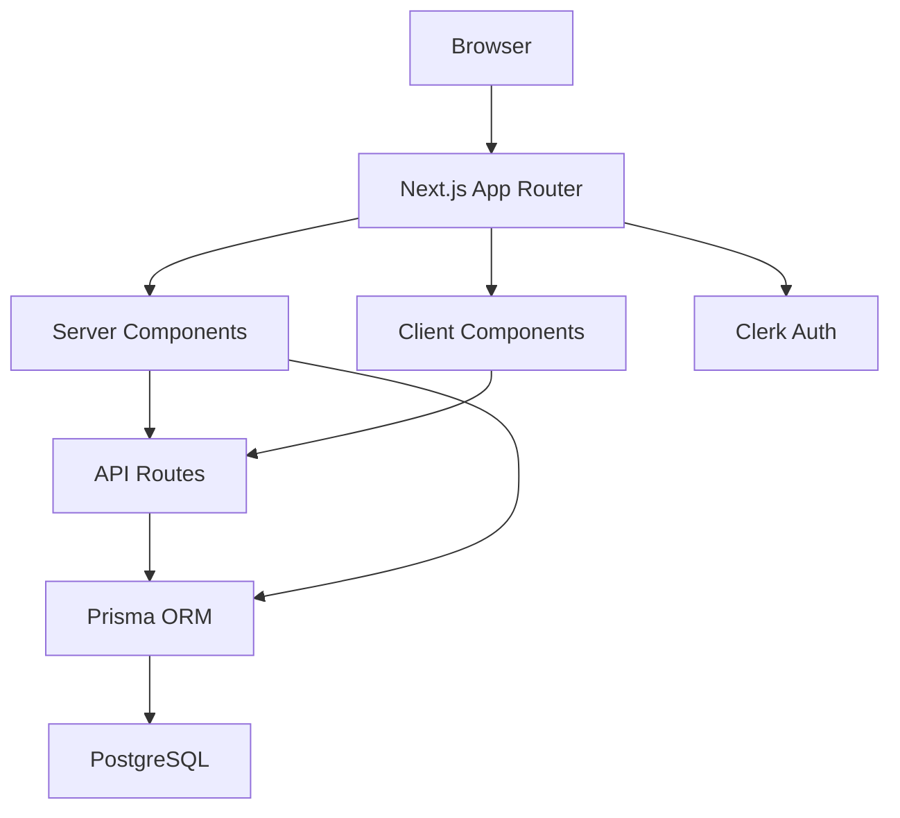

# Project Onboarding Patterns Reference

This document provides practical patterns, examples, and code snippets for systematic project onboarding.

## Architecture Mapping

### Pattern: Layer Detection

Identify architectural layers (presentation, business logic, data access).

```yaml
# Detect layered architecture
discover:
  queries:
    - id: presentation_layer
      type: glob
      patterns:
        - "src/components/**/*"
        - "src/pages/**/*"
        - "src/app/**/*"
    - id: business_layer
      type: glob
      patterns:
        - "src/services/**/*"
        - "src/lib/**/*"
        - "src/utils/**/*"
    - id: data_layer
      type: glob
      patterns:
        - "src/models/**/*"
        - "src/repositories/**/*"
        - "src/db/**/*"
        - "prisma/**/*"
  verbosity: count_only
```

**Interpretation:**
- High file count in `components/` -> presentation-heavy (UI-focused app)
- High file count in `services/` -> business logic-heavy (backend-focused app)
- Balanced counts -> full-stack application

### Pattern: Module Boundary Detection

Use import analysis to detect module coupling.

```yaml
# Find cross-module imports
precision_grep:
  queries:
    - id: feature_to_feature_imports
      pattern: '^import .* from ["'']\.\.\/(auth|payments|users|products)'
      glob: "src/features/**/*.{ts,tsx}"
  output:
    format: locations
    max_per_item: 5
  verbosity: minimal
```

**Red flags:**
- High cross-feature imports -> tight coupling
- Circular imports -> architectural smell
- Deep relative imports (`../../../`) -> poor organization

### Pattern: API Surface Mapping

Extract all public exports to understand the API surface.

```yaml
# Use precision_read with symbol extraction
precision_read:
  files:
    - path: "src/lib/index.ts"
      extract: symbols
    - path: "src/api/index.ts"
      extract: symbols
  symbol_filter: ["function", "class", "interface", "type"]
  verbosity: standard
```

**What to look for:**
- Barrel exports (`index.ts`) -> well-organized modules
- Direct exports -> potential namespace pollution
- Type-only exports -> strong type safety culture

## Convention Detection

### Pattern: Component Naming Analysis

Detect component naming patterns.

```yaml
precision_grep:
  queries:
    - id: default_exports
      pattern: 'export default (function|const) [A-Z][a-zA-Z]*'
      glob: "src/components/**/*.{ts,tsx}"
    - id: named_exports
      pattern: 'export (function|const) [A-Z][a-zA-Z]*'
      glob: "src/components/**/*.{ts,tsx}"
  output:
    format: count_only
  verbosity: minimal
```

**Interpretation:**
- More default exports -> one component per file pattern
- More named exports -> multiple components per file

### Pattern: File Organization Rules

Detect co-location vs separation patterns.

```yaml
discover:
  queries:
    - id: test_colocation
      type: glob
      patterns: ["src/**/*.test.{ts,tsx}"]
    - id: test_dedicated
      type: glob
      patterns: ["__tests__/**/*", "tests/**/*"]
    - id: type_colocation
      type: glob
      patterns: ["src/**/*.types.{ts,tsx}"]
    - id: type_dedicated
      type: glob
      patterns: ["src/types/**/*"]
  verbosity: count_only
```

**Interpretation:**
- Test co-location -> `Button.test.tsx` next to `Button.tsx`
- Test separation -> `__tests__/Button.test.tsx`
- Type co-location -> `user.types.ts` next to `user.ts`
- Type separation -> `types/user.ts` in dedicated folder

### Pattern: Import Statement Analysis

Detect import organization preferences.

```yaml
precision_grep:
  queries:
    - id: barrel_imports
      pattern: '^import .* from ["'']\.\/index["''];?$'
      glob: "src/**/*.{ts,tsx}"
    - id: direct_imports
      pattern: '^import .* from ["'']\.\/[a-zA-Z-]+["''];?$'
      glob: "src/**/*.{ts,tsx}"
    - id: alias_imports
      pattern: '^import .* from ["'']@\/'
      glob: "src/**/*.{ts,tsx}"
  output:
    format: count_only
  verbosity: minimal
```

**Interpretation:**
- High barrel imports -> prefers `import { X } from './components'`
- High direct imports -> prefers `import { X } from './components/Button'`
- Alias imports -> uses path aliases (`@/components`)

## Environment Setup

### Pattern: Dependency Installation Strategy

Detect package manager from lock files.

```bash
#!/usr/bin/env bash
set -euo pipefail

if [ -f "pnpm-lock.yaml" ]; then
    printf "Detected pnpm. Installing with: pnpm install\n"
    pnpm install
elif [ -f "yarn.lock" ]; then
    printf "Detected Yarn. Installing with: yarn install\n"
    yarn install
elif [ -f "package-lock.json" ]; then
    printf "Detected npm. Installing with: npm install\n"
    npm install
else
    printf "No lock file found. Using npm as fallback.\n"
    npm install
fi
```

### Pattern: Environment Variable Extraction

Extract required env vars from code.

```yaml
precision_grep:
  queries:
    - id: env_vars
      pattern: 'process\.env\.[A-Z_]+'
      glob: "src/**/*.{ts,tsx,js,jsx}"
  output:
    format: matches
    max_per_item: 50
  verbosity: minimal
```

**Post-process to deduplicate:**

```typescript
// Extract unique env var names
const envVars = new Set<string>();
results.forEach(match => {
  const regex = /process\.env\.([A-Z_]+)/g;
  let m;
  while ((m = regex.exec(match)) !== null) {
    envVars.add(m[1]);
  }
});

console.log('Required env vars:', Array.from(envVars).sort());
// Note: Use structured logger in production
```

### Pattern: Database Schema Inspection

Read Prisma schema to understand data model.

```yaml
precision_read:
  files:
    - path: "prisma/schema.prisma"
      extract: content
  verbosity: standard
```

**Extract models with grep:**

```yaml
precision_grep:
  queries:
    - id: prisma_models
      pattern: '^model [A-Z][a-zA-Z]* \{'
      glob: "prisma/schema.prisma"
  output:
    format: matches
  verbosity: standard
```

## Build Workflow

### Pattern: Script Discovery

Extract all npm scripts from package.json.

```typescript
// Read package.json and parse scripts
interface PackageJson {
  scripts?: Record<string, string>;
}

const packageJson: PackageJson = JSON.parse(
  await readFile('package.json', 'utf-8')
);

const scripts = packageJson.scripts ?? {};

// Categorize scripts
const categories = {
  dev: Object.keys(scripts).filter(k => k.includes('dev') || k === 'start'),
  build: Object.keys(scripts).filter(k => k.includes('build')),
  test: Object.keys(scripts).filter(k => k.includes('test')),
  lint: Object.keys(scripts).filter(k => k.includes('lint') || k.includes('format')),
  db: Object.keys(scripts).filter(k => k.includes('db') || k.includes('migrate') || k.includes('prisma')),
};

console.log('Available scripts:', categories);
// Note: Use structured logger in production
```

### Pattern: Build Validation

Run build and capture output for analysis.

```yaml
precision_exec:
  commands:
    - cmd: "npm run build"
      timeout_ms: 300000
  verbosity: standard
```

**Check for warnings:**

```typescript
// Parse build output for warnings
const warningPatterns = [
  /warning/i,
  /deprecated/i,
  /experimental/i,
  /peer dep/i,
];

const hasWarnings = warningPatterns.some(pattern => 
  buildOutput.stdout.match(pattern) || buildOutput.stderr.match(pattern)
);

if (hasWarnings) {
  console.warn('Build completed with warnings - review output');
}
```

## Key Patterns

### Pattern: State Management Detection

Identify state management approach.

```yaml
discover:
  queries:
    # React built-in
    - id: use_state
      type: grep
      pattern: 'useState|useReducer|useContext'
      glob: "src/**/*.{ts,tsx}"
    # Zustand
    - id: zustand
      type: grep
      pattern: '(create|useStore).*zustand'
      glob: "src/**/*.{ts,tsx}"
    # Redux Toolkit
    - id: redux
      type: grep
      pattern: 'createSlice|configureStore|useSelector'
      glob: "src/**/*.{ts,tsx}"
    # Jotai
    - id: jotai
      type: grep
      pattern: 'atom|useAtom.*jotai'
      glob: "src/**/*.{ts,tsx}"
    # Recoil
    - id: recoil
      type: grep
      pattern: 'atom|useRecoilState'
      glob: "src/**/*.{ts,tsx}"
  verbosity: count_only
```

**Interpretation:**
- Highest count indicates primary state management approach
- Multiple approaches -> migration in progress or mixed patterns

### Pattern: Data Fetching Strategy

Detect data fetching patterns.

```yaml
discover:
  queries:
    # React Query / TanStack Query
    - id: react_query
      type: grep
      pattern: 'useQuery|useMutation|QueryClient'
      glob: "src/**/*.{ts,tsx}"
    # SWR
    - id: swr
      type: grep
      pattern: 'useSWR|SWRConfig'
      glob: "src/**/*.{ts,tsx}"
    # Next.js Server Components
    - id: server_components
      type: grep
      pattern: 'async function.*await'
      glob: "app/**/*.{ts,tsx}"
    # tRPC
    - id: trpc
      type: grep
      pattern: 'trpc|useQuery|useMutation'
      glob: "src/**/*.{ts,tsx}"
  verbosity: count_only
```

### Pattern: Authentication Flow

Map authentication implementation.

```yaml
discover:
  queries:
    # Clerk
    - id: clerk
      type: grep
      pattern: 'ClerkProvider|useUser|useAuth'
      glob: "src/**/*.{ts,tsx}"
    # NextAuth / Auth.js
    - id: nextauth
      type: grep
      pattern: 'NextAuth|getServerSession|useSession'
      glob: "**/*.{ts,tsx}"
    # Lucia
    - id: lucia
      type: grep
      pattern: 'lucia|validateSession'
      glob: "src/**/*.{ts,tsx}"
    # Supabase Auth
    - id: supabase_auth
      type: grep
      pattern: 'supabase.*auth|createClient'
      glob: "src/**/*.{ts,tsx}"
  verbosity: count_only
```

**Find protected routes:**

```yaml
precision_grep:
  queries:
    - id: middleware
      pattern: 'export.*middleware'
      glob: "middleware.{ts,tsx}"
    - id: auth_guards
      pattern: '(withAuth|requireAuth|ProtectedRoute)'
      glob: "src/**/*.{ts,tsx}"
  output:
    format: locations
  verbosity: standard
```

## Documentation Generation

### Pattern: CLAUDE.md Template

Generate AI-friendly project documentation.

```markdown
# [Project Name]

## Overview
[1-2 sentence project description]

## Tech Stack
- **Framework**: Next.js 14 (App Router)
- **Language**: TypeScript
- **Database**: PostgreSQL (Prisma ORM)
- **Auth**: Clerk
- **Styling**: Tailwind CSS
- **State**: Zustand
- **Data Fetching**: React Query

## Architecture

### Directory Structure
```
app/              # Next.js App Router (routes, layouts)
components/       # React components (organized by feature)
lib/              # Utilities, helpers, shared logic
api/              # API route handlers
types/            # TypeScript type definitions
prisma/           # Database schema and migrations
public/           # Static assets
```

### Key Modules
- `app/(auth)/`: Authentication pages (sign-in, sign-up)
- `app/(dashboard)/`: Protected dashboard routes
- `components/ui/`: shadcn/ui components
- `lib/db.ts`: Prisma client singleton
- `lib/auth.ts`: Clerk server helpers

## Development

### Setup
```bash
pnpm install
cp .env.example .env.local
npx prisma migrate dev
pnpm dev
```

### Scripts
- `pnpm dev` - Start dev server (port 3000)
- `pnpm build` - Production build
- `pnpm test` - Run tests
- `pnpm lint` - Run ESLint
- `pnpm typecheck` - Run TypeScript compiler

## Conventions

### Naming
- Components: PascalCase (`UserProfile.tsx`)
- Utilities: camelCase (`formatDate.ts`)
- Hooks: `use` prefix (`useUser.ts`)
- Constants: SCREAMING_SNAKE_CASE (`API_URL`)

### Imports
- Use `@/` alias for absolute imports
- Group imports: external -> internal -> relative
- Auto-sorted by ESLint

### Components
- Server components by default
- Add `'use client'` only when needed
- Props interface named `{ComponentName}Props`

## Testing
- Unit tests: Vitest
- E2E tests: Playwright
- Coverage threshold: 80%

## Deployment
- Platform: Vercel
- CI/CD: GitHub Actions
- Preview: Auto-deploy on PR
- Production: Auto-deploy on merge to main
```

### Pattern: Architecture Diagram Generation

Create mermaid diagrams from codebase structure.

```yaml
# Detect layers and generate diagram
discover:
  queries:
    - id: client_components
      type: grep
      pattern: "'use client'"
      glob: "src/**/*.{ts,tsx}"
    - id: server_components
      type: glob
      patterns: ["app/**/*.{ts,tsx}"]
    - id: api_routes
      type: glob
      patterns: ["app/api/**/*.ts"]
    - id: database_usage
      type: grep
      pattern: 'prisma|db\.(.*?)\.(create|update|delete|findMany)'
      glob: "**/*.{ts,tsx}"
  verbosity: count_only
```

**Generate diagram:**

```markdown
## System Architecture


```

## Common Patterns by Framework

### Next.js App Router

**Route detection:**
```yaml
discover:
  queries:
    - id: pages
      type: glob
      patterns: ["app/**/page.{ts,tsx}"]
    - id: layouts
      type: glob
      patterns: ["app/**/layout.{ts,tsx}"]
    - id: loading_states
      type: glob
      patterns: ["app/**/loading.{ts,tsx}"]
    - id: error_boundaries
      type: glob
      patterns: ["app/**/error.{ts,tsx}"]
  verbosity: files_only
```

### Remix

**Route detection:**
```yaml
discover:
  queries:
    - id: routes
      type: glob
      patterns: ["app/routes/**/*.{ts,tsx}"]
    - id: loaders
      type: grep
      pattern: 'export (const|async function) loader'
      glob: "app/routes/**/*.{ts,tsx}"
    - id: actions
      type: grep
      pattern: 'export (const|async function) action'
      glob: "app/routes/**/*.{ts,tsx}"
  verbosity: count_only
```

### Astro

**Page detection:**
```yaml
discover:
  queries:
    - id: pages
      type: glob
      patterns: ["src/pages/**/*.astro"]
    - id: components
      type: glob
      patterns: ["src/components/**/*.astro"]
    - id: content_collections
      type: glob
      patterns: ["src/content/**/*.{md,mdx}"]
  verbosity: files_only
```

## Troubleshooting

### Issue: Build Fails

**Diagnosis:**
```yaml
precision_exec:
  commands:
    - cmd: "npm run build"
  verbosity: verbose  # Capture full output
```

**Common fixes:**
- Missing env vars -> check `.env.example`
- TypeScript errors -> run `npm run typecheck`
- Dependency issues -> delete `node_modules`, reinstall

### Issue: Tests Fail

**Diagnosis:**
```yaml
precision_exec:
  commands:
    - cmd: "npm test -- --reporter=verbose"
  verbosity: standard
```

**Common fixes:**
- Database not seeded -> run `npx prisma db seed`
- Env vars missing -> check test setup file
- Stale snapshots -> run `npm test -- -u`

### Issue: Dev Server Won't Start

**Diagnosis:**
- Check port availability: `lsof -i :3000`
- Check env vars: ensure `.env.local` exists
- Check dependencies: ensure `node_modules` complete

**Fix:**
```bash
# Kill process on port
kill $(lsof -t -i:3000) 2>/dev/null || true

# Reinstall dependencies
rm -rf node_modules
npm install

# Restart dev server
npm run dev
```
